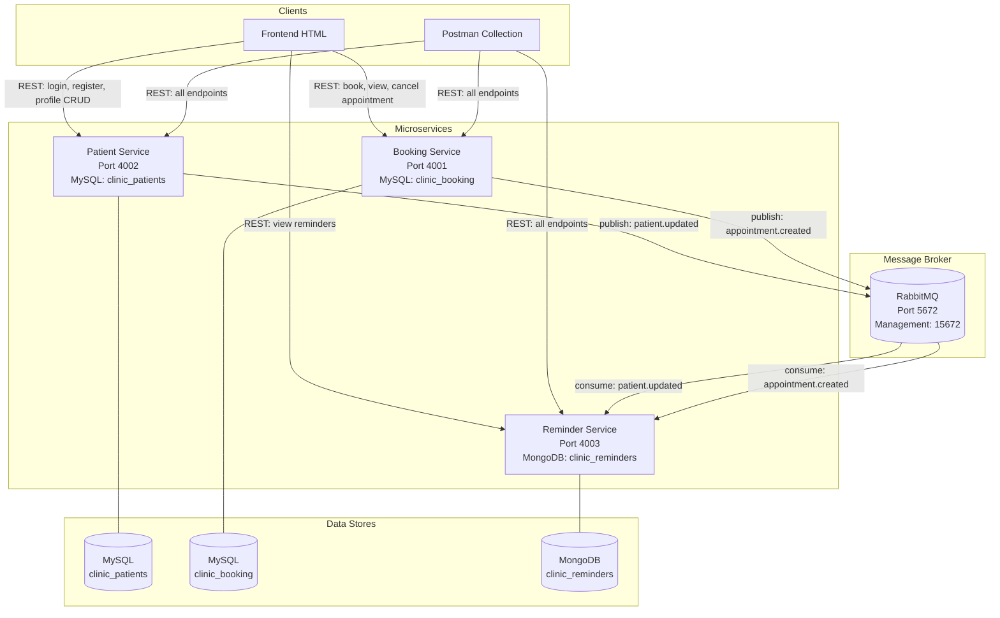
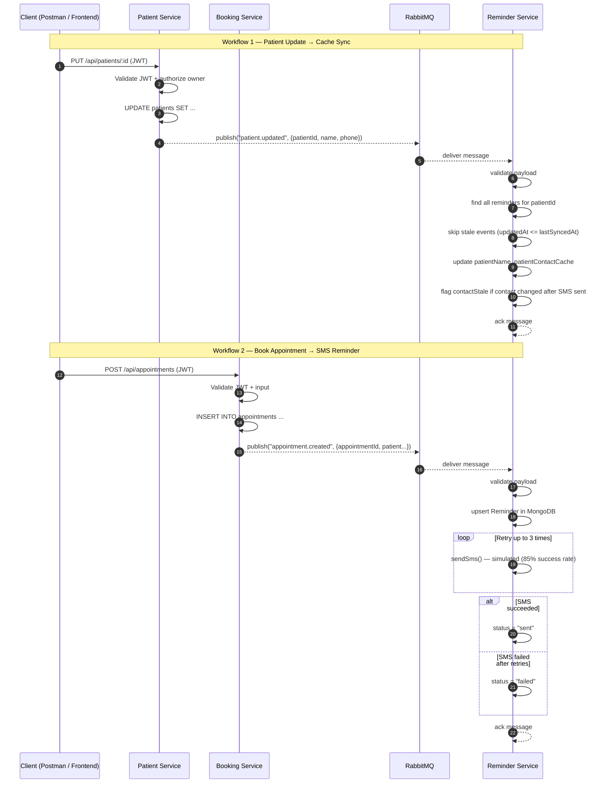

# Architecture & System Integration Diagrams

## 1. System Integration Diagram

This diagram shows how all components connect at the infrastructure level.

## 2. Architecture + Message-Flow Diagram

This diagram traces the two key asynchronous workflows and identifies the integration patterns used.

## 3. Integration Patterns Used

### Pattern 1: Publish-Subscribe (via RabbitMQ)

**Where:** Both `booking-service` and `patient-service` publish events to RabbitMQ queues (`appointment.created` and `patient.updated`). `reminder-service` subscribes to both queues as a consumer.

**Why this pattern:** Publish-Subscribe decouples the producers from the consumer. The booking and patient services do not know (or need to know) that the reminder service exists. If the reminder service is down, messages are persisted in the durable queue and delivered when it comes back online. This also allows adding new consumers (e.g., an analytics service) without modifying the producers.

**Defense:** A Point-to-Point pattern (direct REST call from booking-service to reminder-service) would create tight coupling — if reminder-service is down, the appointment creation would fail or require complex retry logic in the booking service. Publish-Subscribe via a durable message broker provides reliability, scalability, and loose coupling.

### Pattern 2: Point-to-Point (via REST APIs)

**Where:** Clients (frontend/Postman) communicate directly with each service via synchronous REST calls. For example, `POST /api/appointments` calls booking-service directly, and `GET /api/patients/:id` calls patient-service directly.

**Why this pattern:** REST is the standard for synchronous request-response communication. The client needs immediate confirmation that an operation succeeded (e.g., "appointment booked"), which requires a synchronous response. REST with JSON is simple, well-understood, and works across all languages and frameworks.

**Defense:** Using Publish-Subscribe for all communication would be inappropriate because the client needs a synchronous response (HTTP 201 Created, 400 Bad Request, etc.) to know whether the operation succeeded. REST provides this immediate feedback while the async messaging handles the background synchronization work.

## 4. Data Synchronization & Conflict Handling

The system synchronizes patient contact data from MySQL (patient-service) to MongoDB (reminder-service):

1. **Trigger:** When a patient updates their profile via `PUT /api/patients/:id`, patient-service publishes a `patient.updated` event to RabbitMQ.
2. **Consumer:** reminder-service receives the event and finds all reminders belonging to that patient.
3. **Conflict handling (stale events):** If the incoming `updatedAt` timestamp is older than a reminder's `lastSyncedAt`, the event is stale (a newer update was already processed) and is skipped.
4. **Post-send conflict:** If the patient's contact information changed AFTER an SMS was already sent, the reminder is flagged with `contactStale = true` to indicate the sent message may have used outdated contact information.
5. **Graceful degradation:** If RabbitMQ is unavailable, both booking-service and patient-service continue operating normally. Appointments are still saved and profiles are still updated — only the background sync/reminder functionality is temporarily unavailable.
